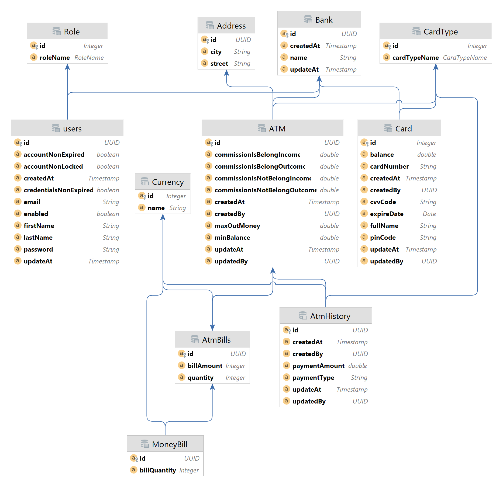

# atm-control-system
Bankomatlardan pul yechilishini va bankomat orqali plastik kartalarga pul o’tkazish ishlarini online nazorat qiluvchi tizim.

    
<h1 align="center">Texnik topshiriq</h1>

 <i>
Ushbu tizim bankomatlardan pul yechilishini va bankomat orqali plastic card ga pul o’tkazish ishlarini online nazorat qiluvchi tizim hisobalandi. Bitta bankning bankomatlari uchun xizmat qiladi.</i>     

<h2 align="center">CARD</h2>

 Xar bir card ning:  
-	maxsus 16 xonali raqami;  
-	Qaysi bankka tegishli ekanligi  
-	3 xonali CVV code  
-	Mijozning familya va ismi  
-	card ning amal qilish muddati  
-	4 xonali maxsus paroli  
-	Plastik turi (HUMO, UZCARD, VISA)  
Agar cardning amal qilish muddati tugagan bo’lsa undan foydalana olmaslik kerak. Aktivlashtirish uchun bank oficedagi mas’ul bu ishni qila oladi.
     

<h2 align="center">BANKOMAT</h2>

Bankomatda quyidagi xususiyatlari bo’ladi:
-	qanday turdagi card lar uchun mo’ljallanganligi (UZCARD, HUMO, VISA)  
-	yechiladigan max pul miqdori (Bu bank tomonidan o’rnatiladi. Bank tomonidan har bir bankomat uchun alohida yoki hamma bankomalatlar uchun bir-xil qo’yilishi mumkin)  
-	Pul yechayotgan card bankomatni o’rnatgan bankga tegishli bo’lsa pul yechayotgandagi commission miqdori va card hisobi to’ldirilayotgandagi comission miqdori  
-	Pul yechayotgan card bankomatni o’rnatgan bankga tegishli bo’lmasa pul yechayotgandagi commission miqdori va card hisobi to’ldirilayotgandagi comission miqdori  
-	Bankomatda minimum qancha mablag’ qolsa bankning mas’ul xodimiga xabar borishligi uchun miqdor (Masalan: 20 000 000 dan kam qolsa emailga kelsin yoki 10 000 000)  
-	Bankomat joylashgan manzil    
  Bankomatda mablag’lar kupyuralar bo’yicha turadi (1000 so’mlik, 5000 so’mlik, 10 000 so’mlik, 50 000 ming so’mlik, 100 000 ming so’mlik, 1$, 5$, 10$, 20$, 50$,100$  kabi alohida qutilarda saqlanadi).  
  Mijoz pul bankomatda har qanday amal bajarishidan oldin cardning pin kodini kiritadi. Agar parol va login to’g’ri bo’lsa, card sistemaga “Basic” authentication orqali kiradi. Login card ning 16 xonali raqami hisoblanadi, uni bankomatni o’zi o’qib oladi, parol card ning pin kodi hisoblanadi.  
  Mijozga pul berilganda qaysi kupyuradan nechi dona berilganligi, card hisobi to’ldirilganda esa qaysi kupyuradan nechta solinganligi saqlanib boriladi.  
  Bankda bankomatlarni hisobini haqiqatan real naqd pul bilan to’ldiriladi va sistemaga bu haqida ma’lumot kiritadi. Ya’ni bankomat hisobi to’ldirildi deb. Bu jarayon uchun mas’ul xodim biriktiriladi. Bunda qaysi kupyuradan nechta solinganligi kiritiladi.  
  Agar pul yechish jarayonida card ning pin kodi 2 martadan ortiq noto’g’ri kiritilsa card block holatiga o’tkaziladi va card ning egasini bank officega borib bu blokdan chiqaradi.  
  Agar mijoz yechmoqchi bo’lgan summa kupyuralar bo’yicha hisob-kitob qilinganda bunday miqdorda kupyura chiqmasa, mijzoga bu haqida xabar qaytarishi kerak.  
  Agar mijoz cardni to’ldirmoqchi bo’lganda, kiritgan kupyurasi uchun bankomatda bunday kupyura qutisi bo’lmasa, mijzoga bu haqida xabar qaytarishi kerak va kupyura mijozga qaytariladi.  

  
<h2 align="center">USERS</h2>

Tizimda ikkita foydalanuvchi bo’ladi: 
-	Bank direktori; 
-	Bankomatlarning hisobini to’ldirish uchun mas’ul xodim 
Bankomatlarda balance miqdori bankomat uchun belgilangan miqdordan kam qolganda mas’ul xodimning email manziliga ogohlantiruvchi xabar jo’natiladi. 
Bank direktori bankomatlarning hisobotlarini kuzatib boradi: 
-	Kirim-chiqimlar ro’yxati (Mijozlar tomonidan yechilgan va cardga solingan pullar. Bunda bankomat bo’yicha ko’riladi); 
-	Kunlik kirim miqdori (cardga solingan pullar. Bunda bankomat bo’yicha ko’riladi); 
-	Kunlik chiqim miqdori (Mijozlar tomonidan yechilgan. Bunda bankomat bo’yicha ko’riladi) ; 
-	Bankomatga biriktirilgan mas’ul tomonidan to’ldirilganlik ro’yxati (Bunda bankomat bo’yicha ko’riladi. ). 
-	Bankomatda mavjud bo’lgan kupyuralar ro’yxati va miqdori (Bunda bankomat bo’yicha ko’riladi). 
  

<h2 align="center">Atm control system Entity Relationship (ER) Diagram</h2>

